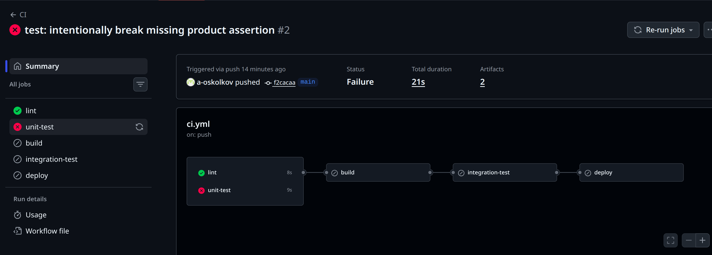
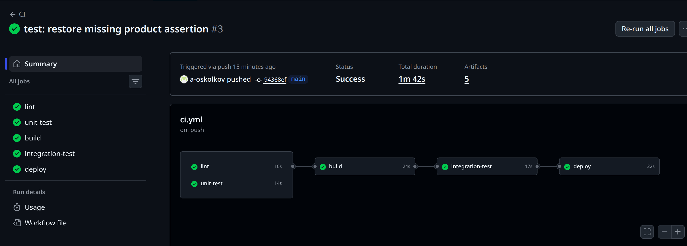

# devops-rk

Рубежный контроль по дисциплине DevOps

## Часть А

### Backend-сервис

Backend-приложение находится в директории `app/`.

Реализованы эндпоинты:

- `GET /products` - список товаров из локального JSON-файла.
- `GET /products/<id>` - товар по id или `404`, если товар не найден.
- `GET /health` - healthcheck endpoint для CI/CD и контейнерной проверки.

Локальный запуск:

```bash
python3 -m venv .venv
source .venv/bin/activate
pip install -r app/requirements-dev.txt
python3 app/app.py
```

Запуск unit-тестов:

```bash
pytest app/tests
```

### Docker

Для приложения написан multi-stage `Dockerfile`.

Особенности образа:

- production-зависимости ставятся отдельно от dev-зависимостей;
- финальный образ запускается от non-root пользователя;
- для запуска используется `gunicorn`;
- dev-зависимости и тесты не попадают в runtime-образ;
- добавлен `HEALTHCHECK`.

Сборка и запуск:

```bash
docker build -t devops-rk-backend .
docker run --rm -p 5000:5000 devops-rk-backend
```

### CI/CD

Pipeline описан в `.github/workflows/ci.yml`.

Этапы:

- `lint` - проверяет код через `ruff`.
- `unit-test` - запускает unit-тесты через `pytest`.
- `build` - собирает Docker-образ только после успешных `lint` и `unit-test`.
- `integration-test` - поднимает контейнер и проверяет endpoint-ы через `curl`.
- `deploy` - публикует образ в GitHub Container Registry только из ветки `main`.

Схема выполнения:

```text
lint ───────┐
            ├── build ─── integration-test ─── deploy
unit-test ──┘
```

`build` является quality gate: он запускается только если обе параллельные проверки, `lint` и `unit-test`, завершились успешно. `deploy` дополнительно ограничен условием запуска только из ветки `main`.

### Проверка падения pipeline

Для демонстрации был сделан намеренно ломающий коммит:

```text
f2cacaa test: intentionally break missing product assertion
```

В нем unit-тест для несуществующего товара ожидал статус 200 вместо правильного 404. Pipeline упал на этапе `unit-test`, а последующие этапы `build`, `integration-test` и `deploy` были пропущены.

Ссылка на запуск: <https://github.com/a-oskolkov/devops-rk/actions/runs/25445297375>



### Успешный pipeline

После исправления теста был сделан коммит:

```text
94368ef test: restore missing product assertion
```

Успешный запуск прошел все этапы: `lint`, `unit-test`, `build`, `integration-test`, `deploy`.

Ссылка на запуск: <https://github.com/a-oskolkov/devops-rk/actions/runs/25445346151>



### Registry

После успешного `integration-test` этап `deploy` публикует Docker-образ в GitHub Container Registry.

Registry: <https://github.com/a-oskolkov/devops-rk/pkgs/container/devops-rk>

## Часть Б

Исходный ci.yml

stages:
  - test
  - build
  - lint
  - deploy
 
variables:
  DB_PASSWORD: "prod_pa$$w0rd_2024"
  DOCKER_REGISTRY: "registry.example.com"
 
lint:
  stage: lint
  image: python:latest
  script:
    - pip install ruff
    - ruff check .
  allow_failure: true
 
test:
  stage: test
  image: python:latest
  script:
    - pip install -r requirements.txt
    - pytest tests/ || true
 
build:
  stage: build
  image: docker:latest
  script:
    - docker build -t shop-api:latest .
    - docker push $DOCKER_REGISTRY/shop-api:latest
 
deploy:
  stage: deploy
  script:
    - ssh -o StrictHostKeyChecking=no root@prod.example.com
        "docker pull $DOCKER_REGISTRY/shop-api:latest && docker restart shop-api"
  only:
    - branches

Ошибки:
1. Захардкоженый пароль 
- пароль попадает в гит историю, логи и остается там даже после удаления из файла
- удалить секрет и переписать гит историю, исопльзовать средства для хранения и работы с секретами
2. Деплой запускается из любой ветки
- любой коммит в любую ветку запускает деплой 
- разрешить деплой только из main
3. Автоматический деплой в прод без ручного подтверждения
- добавить when:manual
4. Тесты всегда true
5. используется тэг latest
- любая ветка может перезаписать один и тот же тег, нельзя понять, что сейчас в production
- использовать  $CI_COMMIT_SHA
6. нет quality gate
- даже при падении тестов пайплайн все равно будет зеленым
- использовать needs
7. allow_failure:true у lint
- lint перестает быть частью quality gate и является чисто информативным
- убрать aloow_failure:true
8. build и deploy не связаны immutable тэгом
- production может подтянуть не тот образ
- использовать immutable тег $CI_COMMIT_SHA
9. deploy идет под root
- если произойдет компорментация - в контейнере можно будет делать все, что душе угодно 
- создавать отдельного деплой пользователя с минимальными правами
10. неправильный порядок стадий test -> build -> lint -> deploy
- build выполняется дольше , поэтому его стоит запускать после lint и test, а их в свою очередь пускать параллельно 

## Часть С

### 1-2 месяца

В первые 1-2 месяца команде стоит внедрить минимальный обязательный CI. Вся работа должна вестись только через pull request, main защищен, merge в main разрешен только после успешного пайплайна и review.

Тут же хорошо использовать branching-стратегию, т. е. создавать ветки для фичей и потом их мерджить в main. При этом это должно быть TBD, а не GitFlow, то есть ветки создаются часто и содержат небольшие изменения, что уменьшает merge-конфликты и ускоряет процессы. Это сделает интеграцию и команду в целом более организованной, но потребует ожидания review для каждой задачи.

Одновременно с этим нужно реализовать CI: build, lint, unit-тесты, docker build, публикация образа, хранение секретов в GitHub Secrets/аналогах. Важно, чтобы сборка была достаточно быстрой и не занимала слишком много времени.

Цена таких действий - несколько дней написания тестов и пайплайна.

### 3-6 месяцев

Через 3-6 месяцев можно усложнить пайплайн, перейти к diamond-схеме, внедряя и запуская параллельно unit-тесты, интеграционные тесты, линтинг, SAST. Это позволит допускать меньше дефектов в main и оптимизировать время CI.

Цена - больше ресурсов и поддержка тестовой инфраструктуры.

На этом же этапе нужна staging-среда. После успешной сборки образ деплоится в staging и проходит smoke-тесты, а также contract-тесты между микросервисами. В production деплой только ручной.

### 6-12 месяцев

К 6-12 месяцам, когда появятся 5 микросервисов, нужно стандартизировать пайплайны: reusable workflows/templates, path filtering для запуска только затронутых сервисов, единые quality gates. Иначе возникнет snowflake pipeline, где каждый сервис деплоится по-своему.

Цена - время DevOps и договоренности о едином шаблоне.

Тогда же стоит внедрить feature flags. Они позволяют держать код в main, но не показывать незавершенную функциональность пользователям. Это ключевое условие trunk-based development: деплой отделяется от релиза.

Цена - новая зависимость вроде Unleash/LaunchDarkly и обязанность удалять устаревшие флаги.

### После стабилизации процессов

В самом конце можно переходить к GitOps/ArgoCD и canary или blue-green. ArgoCD нужен, когда Kubernetes уже стал основной платформой, а инфраструктурные манифесты должны быть декларативным источником истины.

Canary/blue-green имеет смысл только при наличии мониторинга, метрик ошибок, latency и автоматического rollback. Иначе это будет усложнение без контроля.
